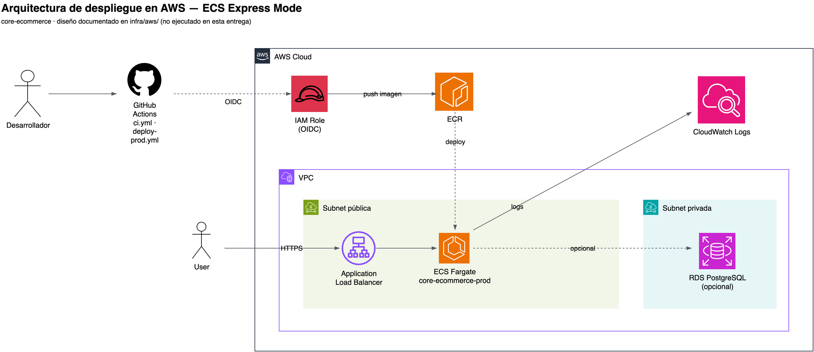
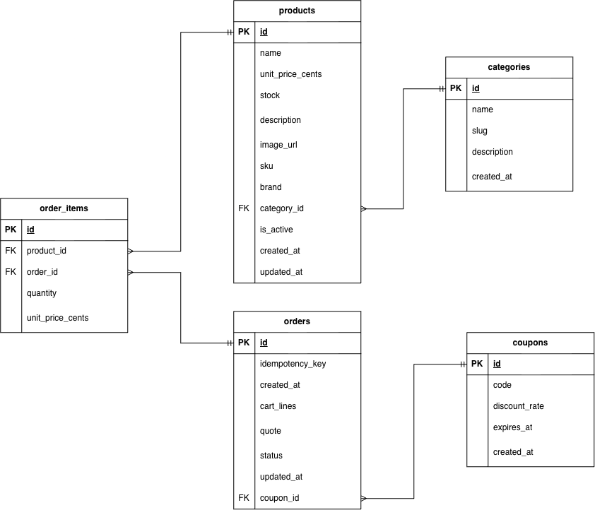

# Arquitectura — Core E-Commerce Checkout

## Diagramas

**Despliegue en AWS** (fuente editable: [`diagrams/diagrama-arquitectura-aws.drawio`](./diagrams/diagrama-arquitectura-aws.drawio))



**Modelo de datos** (fuente editable: [`diagrams/diagrama-bd.drawio`](./diagrams/diagrama-bd.drawio))



## 1. ¿Por qué este stack y este diseño de carpetas?

| Decisión | Elección | Por qué |
|---|---|---|
| Monorepo | **npm workspaces** | Nativo en npm 11 (ya instalado). Cero herramientas nuevas que instalar, configurar o defender frente al evaluador. |
| Backend | **Express 5 + TypeScript estricto** | Framework dominado por el autor; permite tratarlo explícitamente como un *detalle de infraestructura* (un adaptador HTTP) en vez de que defina la forma del dominio. |
| Arquitectura | **Hexagonal (Ports & Adapters)** | El área de Open Banking del autor migra hacia multinube/multirregión. Este proyecto demuestra el mismo argumento a escala pequeña: el dominio no sabe dónde corre ni cómo se persiste. |
| Frontend | **React 19 + Vite + TypeScript** | Vitest en front y back → un solo test runner, un solo comando de cobertura (`npm run test:coverage`). |
| Dinero | **Enteros en centavos (`Cents`)** ([`Money.ts`](../apps/backend/src/domain/model/Money.ts)) | `0.1 + 0.2 !== 0.3` en punto flotante. Un core de pagos no puede darse ese lujo. |
| Persistencia | **Postgres**, único adaptador tras el puerto `ProductRepository`/`OrderRepository` — sin variable de entorno para elegir otro | El dominio y los casos de uso solo conocen el puerto, nunca `pg` directamente; eso ya demuestra el patrón Repository sin necesidad de mantener implementaciones paralelas que nadie usa en producción. `docker compose up` levanta todo con un solo comando. |
| Errores | **RFC 9457 Problem Details** ([`problemDetails.ts`](../apps/backend/src/infrastructure/http/problemDetails.ts)) | Estándar de error usado en Open Banking (Berlin Group / OBIE). Un error 500 nunca filtra detalles internos al cliente. |

**Estructura de carpetas** (`apps/backend/src/`):

```
domain/          # PURO — cero imports de Express, pg, ni nada de infraestructura
  model/         # Money, Product, CartLine, Order, errores tipados
  pricing/       # DiscountRule (Strategy), DiscountEngine, DiscountRuleFactory
  ports/         # ProductRepository, OrderRepository (interfaces)
application/     # CalculateQuoteUseCase, CheckoutUseCase — orquestan dominio + puertos
infrastructure/  # Todo lo que SÍ conoce el framework
  http/          # Express: rutas, middlewares, mapeo de errores
  postgres/      # El único adaptador de persistencia real
  config/        # catálogo, variables de entorno
test-support/    # Fakes en memoria de los puertos — SOLO para tests, nunca en producción
```

La regla de dependencia es unidireccional: `infrastructure` → `application` → `domain`. El dominio no importa nada de las otras dos capas.

## 2. Trade-offs asumidos

| Trade-off | Decisión | Costo aceptado |
|---|---|---|
| Portabilidad vs. superficie de mantenimiento | Un único adaptador de persistencia (Postgres), no varios intercambiables por variable de entorno | Se probaron 3 (`memory`/`json`/`postgres`) para demostrar el patrón Repository; se eliminaron los dos primeros porque mantener implementaciones paralelas que nadie usa en producción costaba más de lo que aportaban. El puerto (`ProductRepository`/`OrderRepository`) sigue demostrando el desacople — el dominio no conoce `pg` — sin necesitar una segunda implementación real. |
| Velocidad de entrega vs. rendimiento de cálculo | El motor recalcula todo el carrito en cada cotización, sin memoización | El carrito tiene ≤7 productos; optimizar sería resolver un problema que no existe a esta escala. |
| Un solo artefacto vs. despliegue independiente de frontend | El backend sirve los estáticos del frontend ya compilados ([`app.ts`](../apps/backend/src/app.ts)) | Cero CORS y una sola URL, a costa de no poder escalar frontend y backend por separado. A escala real iría a CDN (S3 + CloudFront) — documentado como tal. |
| ORM vs. SQL explícito | `pg` sin ORM en el adaptador Postgres | Más SQL escrito a mano — pero con Ports & Adapters el SQL **debe** vivir dentro del adaptador; un ORM diluiría exactamente el patrón que se quiere demostrar. |
| Cobertura del adaptador Postgres | Cuenta para el umbral bloqueante del 80% ([`vitest.config.ts`](../apps/backend/vitest.config.ts)) | Es el único adaptador de persistencia y CI ya provisiona un Postgres real (`services.postgres` en `ci.yml`), así que excluirlo escondería justo el código que más importa medir. Solo se excluye `testDatabase.ts` (utilería exclusiva de tests). |
| Sin ESLint | Solo TypeScript estricto (`noUncheckedIndexedAccess`, `exactOptionalPropertyTypes`, etc.) | Un linter con `eslint-plugin-react-hooks` habría atrapado en el momento un bug real que se cometió durante el desarrollo (ver `docs/ia.md`, corrección #1: dispatch durante el render en un test). Se documenta como limitación consciente por presupuesto de tiempo, no como omisión no evaluada. |

## 3. Cómo se aisló el motor de descuentos de la persistencia y los controladores

El motor vive enteramente en `domain/pricing/` y **no importa nada** de Express, `pg`, ni de los repositorios:

```ts
// DiscountEngine.calculate() — firma completa
calculate(
  cartLines: readonly CartLine[],
  products: readonly Product[],      // ← datos ya resueltos, no un repositorio
  couponCode: string | null,
): QuoteResult
```

`products` llega como un arreglo ya resuelto, no como una dependencia inyectada de un repositorio. Esto significa que el motor se puede probar con **datos de prueba en memoria**, sin mocks de red ni de base de datos — así se escribieron las 33 pruebas de [`DiscountEngine.test.ts`](../apps/backend/src/domain/pricing/DiscountEngine.test.ts), incluidas las de property-based testing.

Quién sí conoce los repositorios es la capa de **aplicación** ([`CalculateQuoteUseCase`](../apps/backend/src/application/CalculateQuoteUseCase.ts), [`CheckoutUseCase`](../apps/backend/src/application/CheckoutUseCase.ts)): llaman a `productRepository.findAll()` y le pasan el resultado al motor. El motor nunca decide *de dónde* vienen los productos ni *a dónde* va la orden — esa es la responsabilidad de la capa de aplicación, orquestando puertos.

Los controladores HTTP (`infrastructure/http/routes/`) son la capa más externa: validan con Zod, llaman al caso de uso correspondiente y traducen el resultado (o la excepción) a una respuesta HTTP. No contienen ninguna regla de negocio.

## 4. Patrones de diseño (el enunciado exige ≥2; se implementan 4)

### Strategy — [`DiscountRule.ts`](../apps/backend/src/domain/pricing/DiscountRule.ts)

Cada regla de descuento implementa la misma interfaz (`applies` / `apply`) y decide por sí misma si aplica:

- [`CategoryDiscountRule.ts`](../apps/backend/src/domain/pricing/rules/CategoryDiscountRule.ts) — 10% sobre productos "Tecnología"
- [`VolumeDiscountRule.ts`](../apps/backend/src/domain/pricing/rules/VolumeDiscountRule.ts) — 5% si el subtotal supera $100
- [`CouponDiscountRule.ts`](../apps/backend/src/domain/pricing/rules/CouponDiscountRule.ts) — % del cupón activo

El motor ([`DiscountEngine.ts`](../apps/backend/src/domain/pricing/DiscountEngine.ts)) no conoce ninguna regla concreta: solo pregunta `applies()` y ejecuta `apply()` en el orden que le entregue la Factory. Agregar una cuarta regla (p. ej. "descuento por primera compra") no toca ni una línea del motor.

### Factory — [`DiscountRuleFactory.ts`](../apps/backend/src/domain/pricing/DiscountRuleFactory.ts)

Arma la cadena de reglas **desde configuración** (`ruleOrder: DiscountRuleId[]`), no desde una secuencia de `if`s hardcodeada en el motor:

```ts
DiscountRuleFactory.create({
  ruleOrder: ["category-discount", "volume-discount", "coupon-discount"],
  coupons: await loadCoupons(pool), // tabla `coupons`, no un Map hardcodeado
});
```

### Repository / Ports & Adapters — [`ProductRepository.ts`](../apps/backend/src/domain/ports/ProductRepository.ts), [`OrderRepository.ts`](../apps/backend/src/domain/ports/OrderRepository.ts)

Dos puertos, **un adaptador de producción** ([`PostgresProductRepository.ts`](../apps/backend/src/infrastructure/postgres/PostgresProductRepository.ts) / [`PostgresOrderRepository.ts`](../apps/backend/src/infrastructure/postgres/PostgresOrderRepository.ts)), validado por una [suite de tests de contrato](../apps/backend/src/infrastructure/postgres/contract.test.ts) — el dominio y los casos de uso solo dependen del puerto, nunca de `pg` directamente.

El proyecto tuvo en algún momento adaptadores adicionales (`memory`, `json`) seleccionables por una variable de entorno, pensados para que el evaluador no necesitara Docker. Se eliminaron: mantener tres implementaciones paralelas del mismo repository era más superficie de código que valor real, y la HU3 del enunciado solo pedía persistir en memoria, SQLite o JSON — Postgres ya era una mejora voluntaria sobre eso. Los tests unitarios que necesitan una implementación rápida sin BD usan `test-support/FakeProductRepository.ts` / `FakeOrderRepository.ts` — nunca se instancian en `main.ts`.

### Observer — [`CartContext.tsx`](../apps/frontend/src/state/CartContext.tsx)

El carrito del frontend vive en un único `useReducer` ([`cartReducer.ts`](../apps/frontend/src/state/cartReducer.ts)) expuesto vía Context. Cualquier componente que consuma `useCart()` (`ProductList`, `CartPanel`, `CouponInput`, `DiscountBreakdown`) se re-renderiza automáticamente cuando el estado cambia, sin *prop drilling* entre componentes hermanos.

## 5. El hallazgo del 35% (por qué el tope, tal como está especificado, nunca se activa con el cupón oficial)

Los tres descuentos son **multiplicativos en cascada**, no sumados. Con las reglas oficiales (10% categoría + 5% volumen + 15% cupón `WELCOME2026`), el cliente paga como mínimo:

```
0.90 × 0.95 × 0.85 = 0.72675   →   descuento máximo = 27.325%
```

El 10% solo aplica a la porción "Tecnología" (un carrito 100% Tecnología ya es el caso óptimo; cualquier otro producto lo *baja*), y 5%/15% son constantes. Ni sumando linealmente los tres porcentajes (30%) se alcanza el 35% que exige la HU4.

**Esto está probado, no solo calculado a mano.** El test de property-based [`DiscountEngine.test.ts`](../apps/backend/src/domain/pricing/DiscountEngine.test.ts) genera carritos aleatorios con y sin `WELCOME2026` y verifica, para cada uno:

```ts
expect(result.effectiveDiscountRate).toBeLessThanOrEqual(0.27325 + 1e-9);
expect(result.capApplied).toBe(false);
```

**Decisión tomada:** implementar la especificación al pie de la letra (no se alteró ninguna regla), documentar el hallazgo aquí, y agregar un segundo cupón de catálogo — `BLACKFRIDAY40` (40%) — que sí dispara el tope, para poder demostrar la alerta de la HU4 en vivo durante la sustentación sin tocar una sola línea del motor. Ver el catálogo de cupones en [`catalog.ts`](../apps/backend/src/infrastructure/config/catalog.ts).

Cuando el tope se activa, el motor no solo trunca el total: **reconcilia el desglose por línea** (`DiscountEngine.ts`, función `applyMaxDiscountCap`), devolviendo proporcionalmente el excedente a cada línea para que la suma siga cuadrando centavo a centavo — verificado por test y visible en pantalla como "Ajuste por límite máximo de descuento (35%)".

## 6. Alineación con BIAN

[BIAN](https://bian.org) estructura sus APIs semánticas como *Service Domain → Control Record → Behavior Qualifier*, con *action terms* (`Initiate`, `Evaluate`, `Execute`, `Retrieve`) publicados en OpenAPI.

**Postura honesta:** BIAN es un estándar de la industria **bancaria**, y esto es un e-commerce. Forzar nomenclatura bancaria sobre un carrito de compras sería impostura. Lo que se hace en cambio es adoptar su **semántica y disciplina** (recursos como *control records*, versionado explícito en la ruta, verbos alineados a *action terms*) y documentar aquí el mapeo, señalando expresamente dónde encaja y dónde no:

| Endpoint | Verbo BIAN equivalente | Encaja? |
|---|---|---|
| `GET /api/v1/products` | `Retrieve` sobre un *Control Record* de catálogo | Parcial — BIAN no tiene un Service Domain de "catálogo de e-commerce" |
| `POST /api/v1/cart/quote` | `Evaluate` | Sí — BIAN usa `Evaluate` exactamente para cálculos que no mutan estado |
| `POST /api/v1/checkout` | `Execute` (sobre un *Control Record* de tipo orden/transacción) | Sí — el Service Domain más cercano sería *"Payment Execution"* o *"Consumer Transaction"* |
| `GET /api/v1/orders/:id` | `Retrieve` | Sí |

Reconocer los límites de aplicabilidad de un estándar demuestra más criterio que aplicarlo a ciegas sobre un dominio para el que no fue diseñado.

## 7. Seguridad (resumen — detalle en `docs/ia.md`, auditoría con la skill `api-security-audit`)

- Validación con Zod en todos los bordes ([`packages/contracts`](../packages/contracts/src/schemas.ts)); `helmet`, rate limiting, límite de tamaño de body ([`app.ts`](../apps/backend/src/app.ts)).
- `GET /api/v1/orders/:id` requiere `X-Api-Key` (fail-closed: sin key configurada, se rechaza toda solicitud) — expone qué se compró y por cuánto. Los demás endpoints son públicos porque los consume un navegador anónimo; una API key ahí sería teatro de seguridad (visible en el JavaScript del cliente).
- `Idempotency-Key` obligatorio en checkout — un reintento por timeout no duplica la orden ni el decremento de stock.
- SQL siempre parametrizado ([`PostgresProductRepository.ts`](../apps/backend/src/infrastructure/postgres/PostgresProductRepository.ts)).
- Contenedor con usuario no-root ([`infra/Dockerfile`](../infra/Dockerfile)).
- Secretos vía `.env` en local / variables de entorno inyectadas en AWS — nunca en el código ni horneados en la imagen.
- **No hay autenticación de usuarios**: no existe identidad de usuario en el alcance del enunciado. En producción se resolvería con OAuth 2.0 + **FAPI** (Financial-grade API, el perfil de OAuth para Open Banking) — agregarlo aquí sería complejidad sin beneficio demostrable.

## 8. Fuera de alcance (descartes deliberados)

| Descartado | Razón |
|---|---|
| Autenticación de usuarios (login, JWT, roles) | No hay identidad de usuario en el alcance del enunciado. Se resolvería con OAuth 2.0 + FAPI en producción. |
| API key en endpoints públicos | Sería visible en el JavaScript del navegador: teatro de seguridad. Se aplica solo donde protege algo real. |
| ORM (Prisma, Drizzle) | Con Ports & Adapters el SQL debe vivir dentro del adaptador — es el punto del patrón. |
| Nomenclatura BIAN literal en las rutas | BIAN es un estándar bancario; esto es un e-commerce. Se documenta el mapeo (§6) en vez de forzar nombres. |
| Frontend en CDN separado (S3 + CloudFront) | Se prioriza paridad de entornos y una sola superficie de despliegue. |
| ESLint | Presupuesto de tiempo; TypeScript estricto cubre buena parte del mismo terreno (ver trade-offs, §2). |
